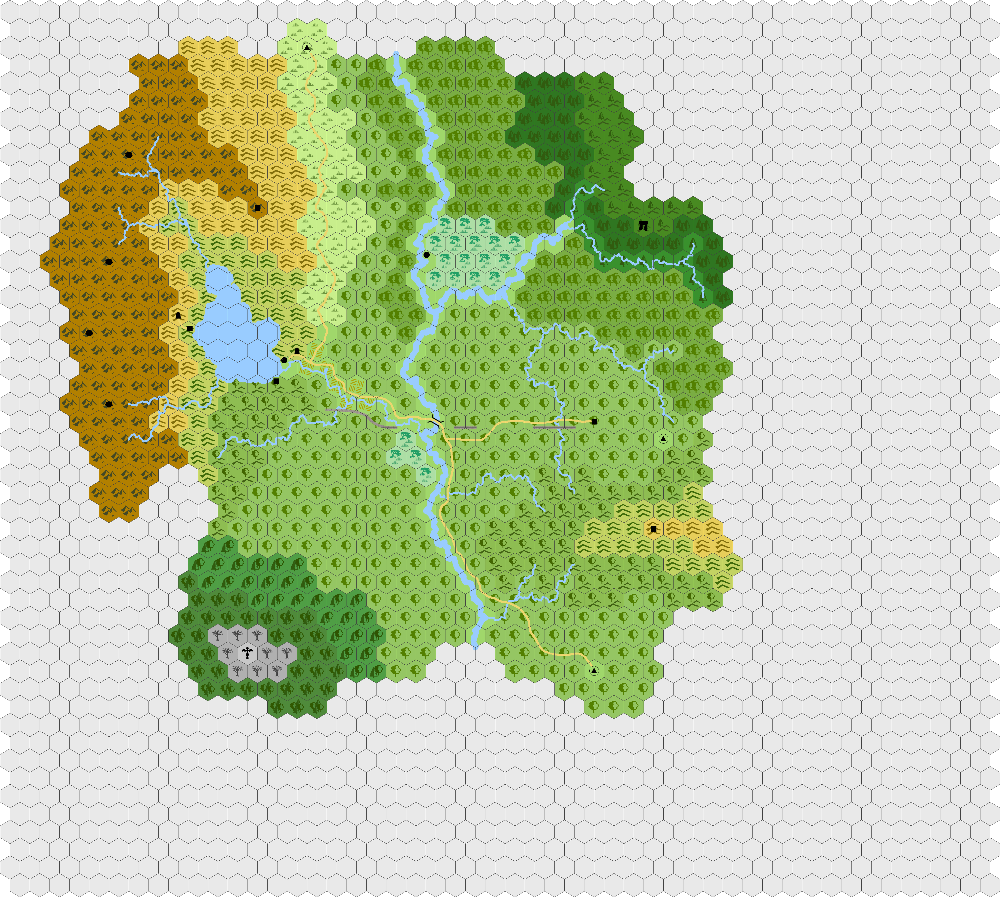

# Imbaru

STOP! This repository contains all my notes and campaign details for a West Marches style megadungeon set in Myrida. If you are a player in this game or *want* to be a player in this game, read no further. Reading further will ruin the experience for you and the other players. You have been warned.

## Myridia

Myridia is a campaign world that will be detailed online at a future point. However, there are some key things about Myridia that are relevant if you want to run this campaign yourself. Read more about it [here](myridia.md).

## Imbaru

Imbaru is a small sphere in Myridia. It is home to a small human and dwarf settlement, the ruins of the city of Caligos, and some other interesting bits and bobs. It has a temperate and somewhat humid climate the makes fog a frequent visitor. With mountains to the west, hills to the east, and a wooded river valley down the middle, the fog tends to collect along the river and throughout the woods giving the lowlands an ethereal and mysterious quality. Ruins of previous occupation dot the landscape, including the ruins of the city of Caligos, a couple of watchtowers, and the remains of an ancient aquaduct.

## Regions

  - [Attercop Woods](regions/attercop-woods.md) - vermin infested woods bordering Damhalba Woods
  - [Big Swamp](regions/big-swamp.md) - large swamp with snakes, shambling mounds, and lizardfolk
  - [Caligos Valley](regions/caligos-valley.md) - wide wooded valley featuring the ruins of Caligos
  - [Damhalba Woods](regions/damhalba-woods.md) - dark, twisted woods where the Unseelie Fey reside
  - [Ebhalba Woods](regions/ebhalba-woods.md) - rugged pine forest where the Seelie Fey reside
  - [Hag Swamp](regions/hag-swamp.md) - small swamp with a relatively friendly hag in it
  - [Hellscathe Mountains](regions/hellscathe-mountains.md) - rocky mountains riddled with caverns
    that are riddled with demons, devils, and fiends
  - [Imbaru River](regions/imbaru-river.md) - large river the flows from the north
  - [Lake Abathos](regions/lake-abathos.md) - mountain lake where locals fish
  - [Mistwood](regions/mistwood.md) - dense woods in the northeast bordering Ebhabla Woods
  - [Northway](regions/northway.md) - grassland and woods surrounding the road from the north gate
  - [Riverwood](regions/riverwood.md) - dense woods to the east of the north road
  - [Rot Ridge](regions/rot-ridge.md) - wooded ridge giving way to red-soiled hills and stone along
    the rise
  - [Scathe Ridge](regions/scathe-ridge.md) - spur off the Hellscathe Mountains from which bandits
    attack travelers along the road
  - [Southridge](regions/southridge.md) - woods containing the south gate
  - [The Vale](regions/the-vale.md) - settled area along a small river with lots of farms

## Places

  - [Brightclach](places/brightclach.md) - stone circle of the Seelie fey
  - [Caves of Chaos](places/caves-of-chaos.md) - fiend-filled natural caverns in the Hellscathe Mountains
  - [Firbenby](places/firbenby.md) - village in Big Swamp with all the lizardfolk
  - [Fons Abathius](places/fons-abathius.md) - the ruined source of the aquaduct that fed Caligos
  - [Metallon](places/metallon.md) - ruins of Dwarven mining village west of lake
  - [Metallon Mines](places/metallon-mines.md) - abandoned Dwarven mines west of Lake Abathos
  - [Northgate](places/northgate.md) - gate at the north end of the sphere
  - [Porthbriste](places/porthbriste.md) - ruins of the broken east gate
  - [Redcap Caves](place/redcap-caves.md) - cavern complex full of Goblins in Rot Ridge
  - [Red Tower](places/red-tower.md) - Tower ruins on southern ridge
  - [Rivercross](places/rivercross.md) - dwarf-crafted bridge over the Imbaru River
  - [Ruins of Caligos](places/ruins-of-caligos.md) - expansive ruins of a once great city
  - [Scathe Ridge Tower](places/scathe-ridge-tower.md) - ruins of tower Tower ruins at Scathe Point
  - [Southgate](places/southgate.md) - gate at the south end of the spher
  - [Turdorcha](places/turdorcha.md) - dark tower of the Unseelie fey
  - [Westfall Mines](places/westfall-mines.md) - the mines that supply the town
  - [Westfalls](places/westfalls.md) - main town in the sphere
