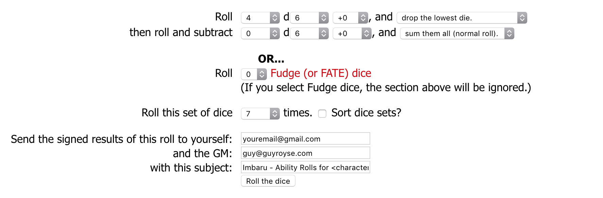

# Player's Guide

This is a guide for the players in Imbaru. Everthing in this section is safe for starting players to look at.

## Imbaru

Imbaru is a small sphere about 35 miles in diameter in Myridia near The Crossings but not connected to them. It has a temperate and somewhat humid climate that makes fog a frequent visitor. With mountains to the west, hills to the east, and a wooded river valley down the middle, the fog tends to collect along the river and throughout the woods giving the lowlands an ethereal and mysterious quality.

There are two gates that lead to neighboring spheres in Imbaru, one each on the north and south sides. An old tiled road connects the two gates, much of it broken and covered with dirt. The north gate leads to a large, glaciated mountain with the road marked by piles of stones. The south gate leads to a flat, arid desert with scrub, cacti, and boulders littering the landscape.

In the foothills of the **Hellscathe Mountains** there is a large, shallow lake that forms the headwaters for a waterfall. The village of **Westmill** is located here and, true to it's name, there is a large, water-powered mill that uses the energy of the falls to grind grist and smash ore. Downstream and along the **Gate Road** are numerous farms providing for the village.

Of course, Men aren't the only inhabitants of Imbaru. There is a tribe of lizardfolk in Big Swamp who sometimes come downriver to trade with the villagers and farmers. Kobolds are occasionally seen in the **Caligos Valley** by hunters but have never bothered anyone. Goblins are know to occasionally attack travelers in the south and bandits more frequently attack those coming from the north.

Ruins of previous civilizations dot the landscape. The most notable is the ruins of **Caligos**, an ancient city that's was destroyed centuries ago and has been abandoned ever since, but there are others including two old watchtowers observing the north and south gates, the remains of an ancient aquaduct that provided water to Caligos, and an old Dwarven mine and village on the far side of **Lake Abathos**.

## Westmill

Westmill is a large village and has a population of almost 800. Most of the population are Men, but there are a few Dwarves who have settled down here as well.

### Commerce

Westmill is off the beaten path and provides for most of its own needs. Common items are readily available, but more complex or luxurious items, like armor and swords, are available but harder to come by as they have to be acquired by trade.

That said, Westmill is along a trade route, albiet an infrequently traversed one. They export a surplus of wool, tobacco, and medicinal herbs. Traders do come, or pass through, and Westmill is an obvious place to rest for the evening. Because of this, Westmill boasts two inns and a dining hall.

Here are a few places of interest:

  - **Barlow's Inn** - Oswin Barlow run this basic inn and tavern where the prices are reasonable and the food is acceptable. Oswin himself is quite amiable and Barlow's is a good place to hear rumors.
  - **Hearth & Eagle** - John Arleigh runs the nicest inn and tavern in town. Prices are double normal but the food is excellent (try the braised cabbage and roast pork) and the beds are soft and warm. Every room is private and this is where wealthy merchants tend to stay.
  - **Sally's Sundries** - Sally Payton sells assorted and miscellaneous goods here.
  - **Thor's Tankard** - Run by Thor Ethelred, this dining hall and tavern is a popular place for locals and vistors alike. The food is good, the ale is plentiful, and the rumors are rampant.
  - **Hammer & Shield** - The only weapon and armor seller in town is a skinny, dark-haired man named Manius Valeria.
  - **The Apothecary** - Wanda Karlkin, a fast-talking Halfling runs the local apothecary. She gathers many of the herbs for her brews herself. Rumor has it that she can also provide poison for those with the coin.
  - **Stables** - Owned by John Arleigh, the town stables have a few horses for sale, and will happily stable a horse. Tack and harness can also be purchased here in an attached shop.

### Production

Westmill and the Vale provide for most of their own needs. They produce their own food; cloth (mostly wool and hemp) for clothing and decor; leather; iron and coal to produce tools and simple weapons; and timber and stone for construction.

  - **Mill** - The mill, owned by Matthew the Miller, is setup to process both lumber and grain. Ore is sometimes crushed here as well. It is powered by the waterfall on the west edge of town.
  - **Mines** - About a mile east of Westmill are the mines. While not very extensive, these mines provide for the town. Just outside of the mine are several kilns for making charcoal as well as a large stone furnace for smelting iron.
  - **Brewer** - Every town needs a brewery. Grain from the surrounding farms is processed to make beer.
  - **Blacksmith** - Aldrin Smith takes pigiron from the mines and works it into useful things such as hinges, nails, horseshoes, and tools. In times of need he can also make basic weapons.
  - **Tannery** About a mile east of Westmill near the mines, is the tannery.

### Government

The government of Westmill is typical of that of a small town or village of Men in Myridia. It consists of the Decurio, the Council of Ten, and the Assembly.

#### The Decurio

The Decurio is is primary executive authority of the government. He is in charge of the constabulary and the militia, and judges all crimes. As is a member or the Town Council and is appointed by them from among their members to serve
for a period of five year. At the end, he returns to the Town Council. An individual can be appointed Decurio as often as the Town Council see fit. The current Decurio is Felix Orbillius.

#### The Council of Ten

The Council of Ten is a group of ten men of age 40 or older. They have three main functions: appoint the Decurio from within their ranks, appoint new members to the Council of Ten, and declare martial law in times of crises. Council members serve for life, but are free to resign if they wish, an act which tradionally happens a 70 years of age.

In addition to the powers of the entire Councile of Ten, individual members can veto any law that the assembly passes within seven days of its passing.

#### The Assembly

The Assembly consists of all Men and Dwarves in the town and surrounding area that are 21 or older and not a member of the Town Council. Their primary function is to establish and abolish laws for the town.

#### The Militia

Tasked with protecting the town and surrounding farms, the militia is made up of every able-bodied male over age 16 or older. Everyone can be called up during times of need, but most serve only a couple days watching the city entrance and the gates. Captain Falcidius is in charge of the militia, reporting directly to the current Decurio.

#### Government Buildings

The government officials have to meet and work somewhere. Here are the places they use:

  - **Council Hall** - This is where the Council of Ten meet and the Decurio administers.
  - **Assembly Hall** - This is a large hall where the people of Westmill meet to practice democracy.
  - **Constabulary** - This small building houses a few cells, and is where Constable Theodosios and his two deputies.
  - **Armory** - The spears, shields, and bows that the militia uses are stored here. Captain Falcidius and whomever is currently on roration for the militia can usually be found here.

### Religion

Myridia is a world of numerous faiths. A village the size of Westmill could hardly have enough temples for all the gods. Instead, they have a section of the town dedicated to all the gods. A small, circular walled garden, it has a central
open-air temple made from stone. At the center is an altar suitable for most worship. The gardens themselves is filled with small shrines, stones, and carvings to hundreds of deities.

All of this space is maintained by the one cleric in town, Eric Everly. Eric spends most of his days tending gardens and occasionally adding a new marker or shrine for a newly discovered diety. He lives is a small house in near the temple
grounds.

Funerals are also performed in the temple. The dead are buried in cemetary, also maintained by Eric, behind the temple ground.

## Making a Character

The campaign will use all the standard rules and that's it. No other sources are permitted. If it's in the Player's Handbook, it's fair game. If you have the Dungeon Master's Guide and want to use the Villainous Class Options on pp. 96-7, that's fine as well. You may also play the Aasimar on pp. 286-7. The Eladrin on p. 286 are not suitable for this campaign and may not be played.

### Classes and Races

Any class or race in the Player's Handbook or Dungeon Master's Guide is permitted with the exception of Eladrin.

### Starting Level

All characters will start at 1st level. If your character permanently dies, you will start again at 1st level.

### Alignment

You can play any alignment you want. Yes, this means you can be evil. But keep in mind that if you play a jerk, others won't want to play with you.

### Rolling Abilities

Abilities will be generated by rolling 4d6 and dropping the lowest die. Generate seven scores this way and drop the lowest score. You get what you get.

The generate the ability score, use [this site](https://www.rpglibrary.org/software/securedice/) and set it up as shown below.

### Starting Gear

Use the rules in the Player's Handbook. If you want to roll starting gold, use the [same site](https://www.rpglibrary.org/software/securedice/) as for rolling your starting abilities.
